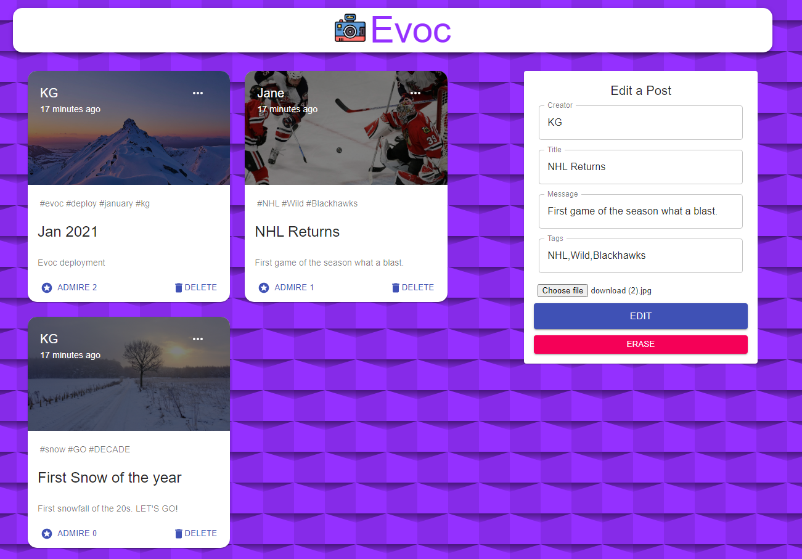

# [Evoc](https://zen-pare-e3c411.netlify.app/)

Evoc is a Full Stack MERN social media applicaiton, meant for sharing and recalling events around the world. Evoc allows users to Create, Read, Update, Delete, Edit and Admire posts on the site.

# Technologies 

### MERN Full Stack
* MongoDB - Evoc uses MongoDB as it's database solution. Data stored includes but is not limited to Creator, Title and Post Images.
* Express(.js) - Evoc uses Express.js and Node.js Web Framework to process GET and POST requests.
* React(.js) - Evoc's interface was built using React's client-side JavaScript framework.
* Node(.js) -  JavaScript Web Server.

# Hosting
* Heroku is used to deploy and manage the server-side services of the application.
* Netlify is used to deploy the client-side of Evoc.

# Challenges
Evoc was built with the aid of [JavaScript Mastery](https://www.completepathtojavascriptmastery.com/), a programming course site dedicated to providing comprehensive guides in JavaScript for both beginners and experts. As this was my first JavaScript project, I used the tutorial as a base for building my knowledge. If a piece of technology was used I would then go off and research before returning to the course.

# Final Deploy
To visit the final build of Evoc click [HERE](https://evoc.netlify.app/).

